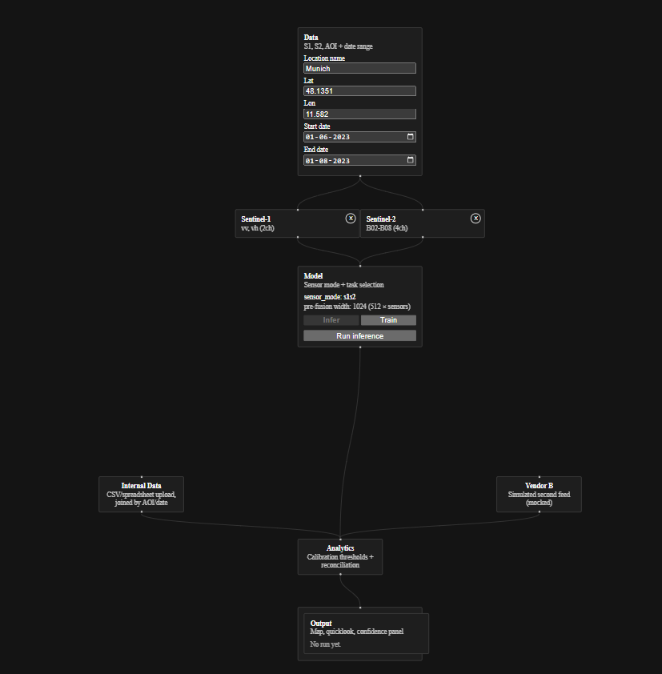

# terrainOS-demo

A V1 technology demonstrator built around **earth-api** (Earth Intelligence Platform),
a modular pipeline that turns Sentinel-1/2 satellite imagery into environmental
insights — deforestation, flood, and land-cover mapping.

The repo is a monorepo with two halves:

- **Backend** (`eintelligence/`, `orchestrator/`, repo root) — the EO pipeline itself:
  fetch imagery → tile it → shared CNN backbone + fusion kernel → task-specific
  segmentation heads → rule-based analytics → a FastAPI orchestration layer.
- **Frontend** (`canvas/`) — a Simulink-style drag-and-drop block canvas that wraps the
  backend and presents it as if it were "a customer's existing EO pipeline." It's the
  actual artifact of this demo — a personal project, not a production product — so it
  favors small, honest, hardcoded shortcuts over general infrastructure.


---

## Backend: the pipeline

Five conceptual layers, each its own top-level package:

```
eintelligence/
├── data_prep/    # Fetch (STAC / Planetary Computer), tile to COGs, manifests, pairing
├── backbone/     # Shared sensor-agnostic CNN encoder
├── fusion/       # Multi-sensor (S1+S2) fusion kernel, sits between backbone and heads
├── adapters/     # Task-specific segmentation heads (deforestation, flood, land cover)
├── analytics/    # Rule-based / statistical post-processing per task
orchestrator/     # Workflow classes gluing the above end-to-end + the FastAPI service
```

A single call — `earth.query(task=..., lat=..., lon=..., start=..., end=...)` — is the
intended shape of the unified interface; today, task/sensor combinations are driven
through per-generation `Workflow` classes in `orchestrator/` rather than one entry point

Land cover is the task currently wired end-to-end to the frontend: STAC ingestion,
S1+S2 fusion, inference against a trained checkpoint, and training-from-scratch, all
served over HTTP by `orchestrator/api_server_canvas.py`.

```bash
pip install -r requirements.txt
uvicorn orchestrator.api_server_canvas:app --reload   # canvas-facing API, http://127.0.0.1:8000
python -m pytest tests/                                # backend test suite
```

---

## Frontend: the canvas

A drag-and-drop node canvas (React + TypeScript + `@xyflow/react`) that mirrors the
backend's pipeline as four top-level blocks:

```
Data → [Sentinel-1 / Sentinel-2] → Model → Analytics → Output
                                       ↑         ↑
                              Internal Data   "Vendor B"
                              (CSV upload)   (mocked feed)
```



- **Data** — AOI + date-range input, with deletable Sentinel-1/Sentinel-2 sensor
  blocks; removing a sensor changes which trained checkpoint gets called (a genuinely
  different, single-sensor model — not a toggle on one running model).
- **Model** — runs inference or training against the backend's land-cover
  endpoints, showing sensor-mode, pre-fusion feature width, and (in training mode)
  real loss/mIoU results.
- **Analytics / Output** — calibration thresholds and a results view (quicklooks,
  per-modality confidence, an illustrative comparison against ESA WorldCover labels).
- **Internal Data** / **Vendor B** — the reconciliation angle that makes this a
  "combine with what the customer already has" demo rather than a thin wrapper around
  the backend; Vendor B is openly simulated, not a real integration.

```bash
export NVM_DIR="$HOME/.nvm"; source "$NVM_DIR/nvm.sh"; nvm use v24.19.0
cd canvas && npm install && npm run dev
```

The canvas talks to the backend over plain HTTP (`GET /canvas/landcover/sensor_modes`,
`POST /canvas/landcover/infer_region`, `POST /canvas/landcover/train`) — no shared
process or imports between the two halves.

---

## Vision

To democratize access to Earth observation intelligence, by making it easier to
explore, combine, and reason about — through a pipeline that turns raw satellite
imagery into insight, and a canvas that makes that pipeline tangible to interact with.
